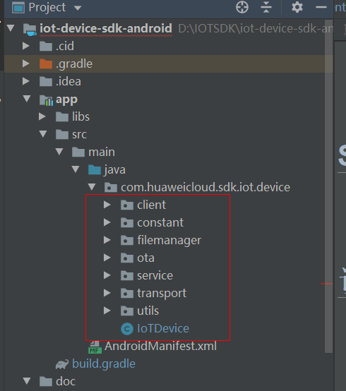
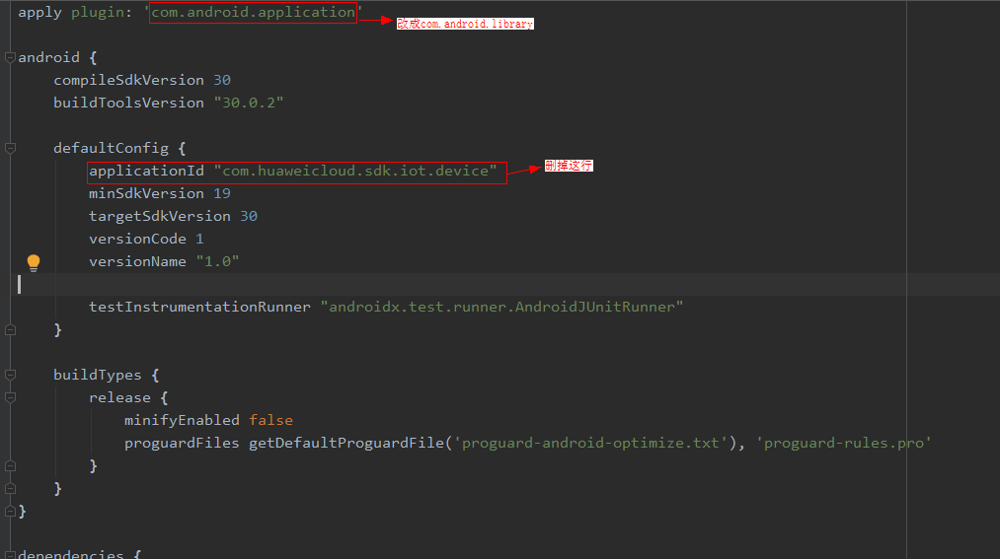
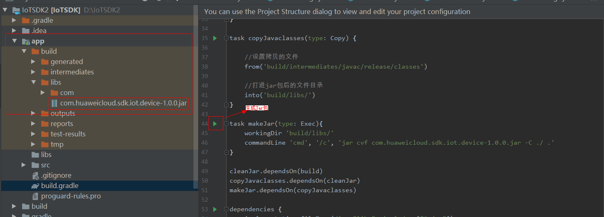
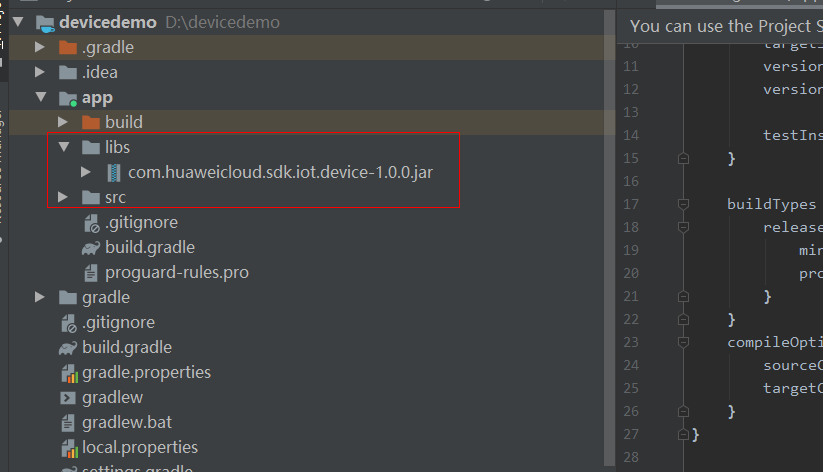
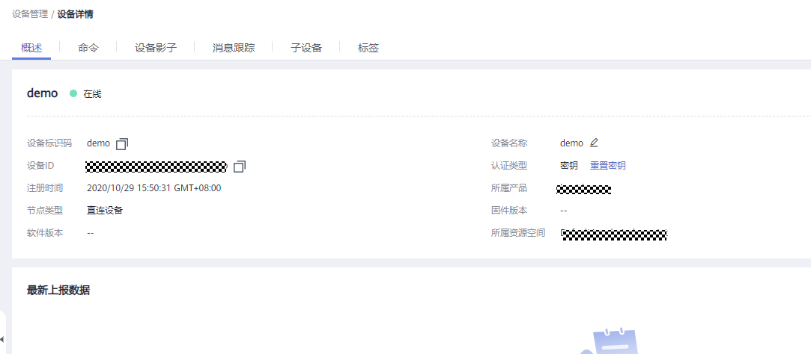
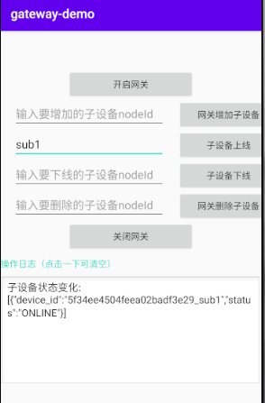
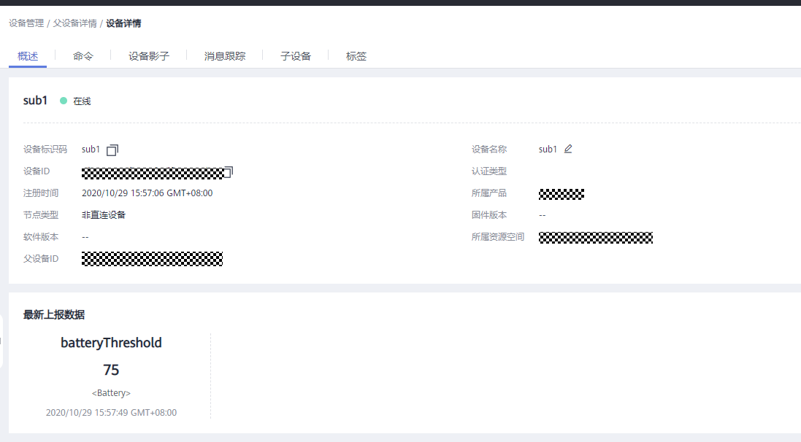

[English](./README.md) | 简体中文

# iot-device-sdk-android开发指南

# 目录

<!-- TOC -->

- [修订记录](#0)
- [前言](#1)
- [SDK简介](#2)
- [准备工作](#3)
- [上传产品模型并注册设备](#4)
- [SDK编译](#5)
- [代码工程配置](#6)
- [设备初始化](#7)
- [属性上报](#8)
- [消息上报](#9)
- [属性读写](#10)
- [消息下发](#11)
- [命令下发](#12)
- [设备影子](#13)
- [OTA升级](#14)
- [文件上传/下载管理](#15)
- [自定义Topic](#16)
- [面向物模型编程](#17)
- [V3接口](#18)
- [网关开发](#19)
- [开源协议](#20)

<h1 id="0">修订记录</h1>
+ 文档版本01 第一次正式发布（2020-10-13）

<h1 id="1">前言</h1>
本文通过实例讲述iot-device-sdk-android（以下简称SDK）帮助设备用MQTT协议快速连接到华为物联网平台。
<h1 id="2">SDK简介</h1>
SDK面向运算、存储能力较强的嵌入式终端设备，开发者通过调用SDK接口，便可实现设备与物联网平台的上下行通讯。SDK当前支持的功能有：
*  支持设备消息、属性上报、属性读写、命令下发
*  支持OTA升级
*  支持文件上传/下载管理
*  支持密码认证和证书认证两种设备接入方式
*  支持自定义topic
*  支持设备影子查询
*  支持物模型编程
*  兼容V3接口
*  支持网关开发

**SDK目录结构**

huaweicloud-iot-device-sdk-android：sdk代码

**第三方类库使用版本**

org.eclipse.paho.client.mqttv3：v1.2.5

gson：v2.8.6

<h1 id="3">准备工作</h1>
*  已安装Android Studio

<h1 id="4">上传产品模型并注册设备</h1>
为了方便体验，我们提供了一个烟感的产品模型，烟感会上报烟雾值、温度、湿度、烟雾报警、还支持响铃报警命令。以烟感例，体验消息上报、属性上报等功能。

1. 访问[设备接入服务](https://www.huaweicloud.com/product/iothub.html)，单击“立即使用”进入设备接入控制台。

3. 访问管理控制台，查看MQTTS设备接入地址，保存该地址。

4. 在设备接入控制台选择“产品”，单击右上角的“创建产品”，在弹出的页面中，填写“产品名称”、“协议类型”、“数据格式”、“厂商名称”、“所属行业”、“设备类型”等信息，然后点击右下角“立即创建”。

   - 协议类型选择“MQTT”；

   - 数据格式选择“JSON”。

5. 产品创建成功后，单击“详情”进入产品详情，在功能定义页面，单击“上传模型文件”，上传烟感产品模型[smokeDetector](https://support.huaweicloud.com/devg-iothub/resource/smokeDetector_cb097d20d77b4240adf1f33d36b3c278_smokeDetector.zip)。

6. 在左侧导航栏，选择“ 设备 > 所有设备”，单击右上角“注册设备”，在弹出的页面中，填写注册设备参数，然后单击“确定”。

7. 设备注册成功后保存设备标识码、设备ID、密钥。

<h1 id="5">SDK编译</h1>
1. 使用Android studio创建Android工程，并设置包名为com.huaweicloud.sdk.iot.device。

   

2. 拷贝iot-device-sdk-android工程下java源码到com.huaweicloud.sdk.iot.device包下面。

   

3. 配置app目录下build.gradle。

   

   build.gradle中添加以下编译脚本

   ```groovy
   task cleanJar(type: Delete){
       //删除存在的
       delete 'build/libs/com.huaweicloud.sdk.iot.device-1.0.0.jar'
       delete 'build/libs/classes/'
   }
   
   task copyJavaclasses(type: Copy) {
   
       //设置拷贝的文件
       from('build/intermediates/javac/release/classes')
   
       //打进jar包后的文件目录
       into('build/libs/')
   }
   
   task makeJar(type: Exec){
       workingDir 'build/libs/'
       commandLine 'cmd', '/c', 'jar cvf com.huaweicloud.sdk.iot.device-1.0.0.jar -C ./ .'
   }
   
   cleanJar.dependsOn(build)
   copyJavaclasses.dependsOn(cleanJar)
   makeJar.dependsOn(copyJavaclasses)
   ```

   build.gradle中dependencies增加以下三个依赖

   ```groovy
   implementation 'com.google.code.gson:gson:2.8.6'
   implementation 'org.eclipse.paho:org.eclipse.paho.client.mqttv3:1.2.5'
   implementation 'androidx.localbroadcastmanager:localbroadcastmanager:1.0.0'
   ```

   Android工程配置完成后，点击build.gradle中task makeJar(请确保java已经添加到环境变量)前绿色箭头，就可以生成jar包。

   

   生成的jar包位于app/build/libs目录下

   

<h1 id="6">代码工程配置</h1>
1. 工程app/libs下添加上文中生成的Jar包。

2. build.gradle中添加以下依赖。

   ```groovy
   implementation fileTree(dir: "libs", include: ["*.jar"])
   implementation 'androidx.localbroadcastmanager:localbroadcastmanager:1.0.0'
   implementation 'org.eclipse.paho:org.eclipse.paho.client.mqttv3:1.2.5'
   implementation 'com.google.code.gson:gson:2.8.6'
   ```

<h1 id="7">设备初始化</h1>
1. 创建设备。

     设备接入平台时，物联网平台提供密钥和证书两种鉴权方式，如果使用MQTTS，请把下载的bks证书放置到src/main/assets下，<a href="https://support.huaweicloud.com/devg-iothub/iot_02_1004.html#ZH-CN_TOPIC_0187644975__section197481637133318" target="_blank">下载证书文件</a>。

   - 密钥方式接入。

     ```java
     IoTDevice device = new IoTDevice(mContext, "ssl://iot-mqtts.cn-north-4.myhuaweicloud.com:8883", "5eb4cd4049a5ab087d7d4861_demo", "secret");
     ```

   - 证书模式接入。

     华为物联网平台支持设备使用自己的X.509证书接入鉴权。在SDK中使用X.509证书接入时，需自行制作设备证书，并放到调用程序根目录下。SDK调用证书的根目录为\iot-device-feature-test\bin\Debug\certificate。

     接入步骤请参考：

     - 制作设备CA调测证书，详细指导请参考<a href="https://support.huaweicloud.com/usermanual-iothub/iot_01_0055.html" target="_blank">注册X.509证书认证的设备</a>。

     - 制作成功后，生成Keystore，可参考以下代码实现。

       ```java
       String keyPassword = "123456";
       
               Certificate cert = null;
               InputStream inputStream = getAssets().open("deviceCert.pem");
               try {
                   CertificateFactory cf = CertificateFactory.getInstance("X.509");
                   cert = cf.generateCertificate(inputStream);
               } finally {
                   if(inputStream != null){
                       inputStream.close();
                   }
               }
       
               KeyPair keyPair = null;
               InputStream keyInput = getAssets().open("deviceCert.key");
               try{
                   PEMParser pemParser = new PEMParser(new InputStreamReader(keyInput, StandardCharsets.UTF_8));
                   Object object = pemParser.readObject();
                   BouncyCastleProvider provider = new BouncyCastleProvider();
                   JcaPEMKeyConverter converter = new JcaPEMKeyConverter().setProvider(provider);
                   if (object instanceof PEMEncryptedKeyPair) {
                       PEMDecryptorProvider decryptionProvider = new JcePEMDecryptorProviderBuilder().setProvider(provider).build(keyPassword.toCharArray());
                       PEMKeyPair keypair = ((PEMEncryptedKeyPair) object).decryptKeyPair(decryptionProvider);
                       keyPair = converter.getKeyPair(keypair);
                   } else {
                       keyPair = converter.getKeyPair((PEMKeyPair) object);
                   }
               }finally {
                   if(keyInput != null){
                       keyInput.close();
                   }
               }
               if (keyPair == null) {
                   Log.e(TAG, "keystoreCreate: keyPair is null");
                   return;
               }
       
               KeyStore keyStore = .getInstance(KeyStore.getDefaultType());
               keyStore.load(null, null);
               keyStore.setCertificateEntry("certificate", cert);
               keyStore.setKeyEntry("private-key", keyPair.getPrivate(), keyPassword.toCharArray(),
                       new Certificate[]{cert});
       ```

     - 生成KeyStore后调用以下代码，创建设备。

       ```java
       IoTDevice device = new IoTDevice(mContext, "ssl://iot-mqtts.cn-north-4.myhuaweicloud.com:8883", "5eb4cd4049a5ab087d7d4861_demo", keyStore, "secret");
       ```

2. 注册本地广播IotDeviceIntent.ACTION_IOT_DEVICE_CONNECT，用于处理设备初始化后的结果。

   ```java
   LocalBroadcastManager.getInstance(this).registerReceiver(connectBroadcastReceiver, new IntentFilter(IotDeviceIntent.ACTION_IOT_DEVICE_CONNECT));
   
   //广播携带数据
   int broadcastStatus = intent.getIntExtra(BaseConstant.BROADCAST_STATUS, BaseConstant.STATUS_FAIL);
                   switch (broadcastStatus) {
                       case BaseConstant.STATUS_SUCCESS:
                           //设备创建成功
                           break;
                       case BaseConstant.STATUS_FAIL:
                           //设备创建失败
                           //失败原因
                           String error = intent.getStringExtra(COMMON_ERROR);
                           break;
                   }
   ```

3. 设备初始化。

   ```java
   device.init();
   ```

<h1 id="8">属性上报</h1>
4. 接口调用

   ```java
   //创建属性
   List<ServiceProperty> serviceProperties = getServiceProperties();
   
   //上报属性
   device.getClient().reportProperties(serviceProperties);
   ```

2. 注册广播IotDeviceIntent.ACTION_IOT_DEVICE_PROPERTIES_REPORT，用于处理属性上报的结果。

   ```java
   LocalBroadcastManager.getInstance(this).registerReceiver(propertyBroadcastReceiver, new IntentFilter(IotDeviceIntent.ACTION_IOT_DEVICE_PROPERTIES_REPORT));
   
   //广播携带数据
   int broadcastStatus = intent.getIntExtra(BaseConstant.BROADCAST_STATUS, BaseConstant.STATUS_FAIL);
                   switch (broadcastStatus) {
                       case BaseConstant.STATUS_SUCCESS:
                           edtLog.append("上报属性成功!" + "\n");
                           break;
                       case BaseConstant.STATUS_FAIL:
                           String error = intent.getStringExtra(PROPERTIES_REPORT_ERROR);
                           edtLog.append("上报属性失败!失败原因：" + error + "\n");
                           break;
                   }
   ```

<h1 id="9">消息上报</h1>
1. 接口调用

   ```java
   //创建消息
   DeviceMessage deviceMessage = new DeviceMessage();
   
   //上报消息
   device.getClient().reportDeviceMessage(deviceMessage);
   ```

2. 注册广播IotDeviceIntent.ACTION_IOT_DEVICE_SYS_MESSAGES_UP，用于处理消息上报的结果。

   ```java
   LocalBroadcastManager.getInstance(this).registerReceiver(messageBroadcastReceiver, new IntentFilter(IotDeviceIntent.ACTION_IOT_DEVICE_SYS_MESSAGES_UP));
   
   //广播携带数据
   int broadcastStatus = intent.getIntExtra(BaseConstant.BROADCAST_STATUS, BaseConstant.STATUS_FAIL);
                   switch (broadcastStatus){
                       case BaseConstant.STATUS_SUCCESS:
                           edtLog.append("消息上报成功！" + "\n");
                           break;
                       case BaseConstant.STATUS_FAIL:
                           String error = intent.getStringExtra(BaseConstant.COMMON_ERROR);
                           edtLog.append("消息上报失败！失败原因：" + error + "\n");
                           break;
                   }
   ```

<h1 id="10">属性读写</h1>
1. 注册广播IotDeviceIntent.ACTION_IOT_DEVICE_SYS_PROPERTIES_GET和IotDeviceIntent.ACTION_IOT_DEVICE_SYS_PROPERTIES_SET，用于接收平台读写设备属性。

   ```
   //平台查询设备属性广播
   LocalBroadcastManager.getInstance(this).registerReceiver(propertyBroadcastReceiver, new IntentFilter(IotDeviceIntent.ACTION_IOT_DEVICE_SYS_PROPERTIES_GET));
   
   //平台查询设备属性广播携带数据
   requestId = intent.getStringExtra(BaseConstant.REQUEST_ID);
   serviceId = intent.getStringExtra(BaseConstant.SERVICE_ID);
   edtLog.append("平台查询设备属性: " + "requestId=" + requestId + ",serviceId=" + serviceId + "\n");
   
   //平台设置设备属性广播
   LocalBroadcastManager.getInstance(this).registerReceiver(propertyBroadcastReceiver, new IntentFilter(IotDeviceIntent.ACTION_IOT_DEVICE_SYS_PROPERTIES_SET));
   
   //平台设置设备属性广播携带数据
   requestId = intent.getStringExtra(BaseConstant.REQUEST_ID);
   PropsSet propsSet = intent.getParcelableExtra(BaseConstant.SYS_PROPERTIES_SET);
   ```

2. 接口调用

   ```java
   //设备响应平台查询设备属性
   List<ServiceProperty> serviceProperties = getServiceProperties();
   device.getClient().respondPropsGet(requestId, serviceProperties);
   
   //设备上报平台设置设备属性结果
   IotResult iotResult = new IotResult(0, "success");
   device.getClient().respondPropsSet(requestId, iotResult);
   ```

<h1 id="11">消息下发</h1>
注册广播IotDeviceIntent.ACTION_IOT_DEVICE_SYS_MESSAGES_DOWN，用于接收平台下发的消息。

```
LocalBroadcastManager.getInstance(this).registerReceiver(messageBroadcastReceiver, new IntentFilter(IotDeviceIntent.ACTION_IOT_DEVICE_SYS_MESSAGES_DOWN));

//消息下发广播携带数据
DeviceMessage deviceMessage = intent.getParcelableExtra(BaseConstant.SYS_DOWN_MESSAGES);
```

<h1 id="12">命令下发</h1>
1. 注册广播IotDeviceIntent.ACTION_IOT_DEVICE_SYS_COMMANDS，用于接收平台下发的命令。

   ```java
   LocalBroadcastManager.getInstance(this).registerReceiver(messageBroadcastReceiver, new IntentFilter(IotDeviceIntent.ACTION_IOT_DEVICE_SYS_COMMANDS));
   
   //命令下发广播携带数据
    requestId  = intent.getStringExtra(BaseConstant.REQUEST_ID);
    Command command = intent.getParcelableExtra(BaseConstant.SYS_COMMANDS);
   ```

2. 接口调用

   ```java
   //设备响应平台命令执行结果
   //响应实体
   CommandRsp commandRsp = new CommandRsp(CommandRsp.SUCCESS);
   //参数设置
   ......
   //上报响应
   device.getClient().respondCommand(requestId, commandRsp);
   ```

<h1 id="13">设备影子</h1>
1. 接口调用

   ```java
   //设备获取平台影子数据
   ShadowGet shadowGet = new ShadowGet();
   device.getClient().getShadowMessage(shadowGet);
   ```

2. 注册广播IotDeviceIntent.ACTION_IOT_DEVICE_SYS_SHADOW_GET，用于接收平台下发的设备影子数据。

   ```java
   LocalBroadcastManager.getInstance(this).registerReceiver(propertyBroadcastReceiver, new IntentFilter(IotDeviceIntent.ACTION_IOT_DEVICE_SYS_SHADOW_GET));
   
   //设备影子广播携带数据
   requestId = intent.getStringExtra(BaseConstant.REQUEST_ID);
   ShadowMessage shadowMessage = intent.getParcelableExtra(BaseConstant.SHADOW_DATA);
   ```

<h1 id="14">OTA升级</h1>
1. 软件升级。参考<a href=" https://support.huaweicloud.com/usermanual-iothub/iot_01_0047.html#section3 " target="_blank">软件升级指导</a>上传软件包。

2. 固件升级。参考<a href=" https://support.huaweicloud.com/usermanual-iothub/iot_01_0027.html#section3 " target="_blank">固件升级</a>上传固件包。

3. 注册广播IotDeviceIntent.ACTION_IOT_DEVICE_UPGRADE_EVENT，用于接收平台下发升级通知数据，IotDeviceIntent.ACTION_IOT_DEVICE_VERSION_QUERY_EVENT用于接收平台获取版本信息。

   ```java
   //平台下发升级通知广播
   LocalBroadcastManager.getInstance(this).registerReceiver(upgradeBroadcastReceiver,
                   new IntentFilter(IotDeviceIntent.ACTION_IOT_DEVICE_UPGRADE_EVENT));
   
   //平台下发升级通知广播携带数据
   OTAPackage pkg = intent.getParcelableExtra(BaseConstant.OTAPACKAGE_INFO);
   edtLog.append("平台下发升级通知:" + JsonUtil.convertObject2String(pkg) + "\n");
   
   //平台下发获取版本信息广播
   LocalBroadcastManager.getInstance(this).registerReceiver(upgradeBroadcastReceiver,
                   new IntentFilter(IotDeviceIntent.ACTION_IOT_DEVICE_VERSION_QUERY_EVENT));
   ```

4. 接口调用

   ```java
   //设备上报软固件版本
   device.getOtaService().reportVersion(fwVersion, swVersion);
   //设备上报升级状态
   device.getOtaService().reportOtaStatus(resultCode, progress, version, description);
   ```

<h1 id="15">文件上传/下载管理</h1>
1. 接口调用

   ```java
   //获取文件上传URL
   String fileName；
   Map<String, Object> fileAttributes = new HashMap<String, Object>();
   device.getFileManager().getUploadUrl(fileName, fileAttributes);
   
   //上报文件上传结果
   Map<String, Object> paras;
   device.getFileManager().uploadResultReport(paras);
   
   //获取文件下载URL
   String fileName；
   Map<String, Object> fileAttributes = new HashMap<String, Object>();
   device.getFileManager().getDownloadUrl(fileName, fileAttributes);
   
   //上报文件下载结果
   Map<String, Object> paras;
   device.getFileManager().downloadResultReport(paras);
   ```

2. 注册广播IotDeviceIntent.ACTION_IOT_DEVICE_GET_UPLOAD_URL，用于接收平台下发文件上传临时URL通知，IotDeviceIntent.ACTION_IOT_DEVICE_GET_DOWNLOAD_URL用于接收下发文件下载临时URL通知。

   ```java
LocalBroadcastManager.getInstance(this).registerReceiver(fileManagerBroadcastReceiver,
                   new IntentFilter(IotDeviceIntent.ACTION_IOT_DEVICE_GET_UPLOAD_URL));       LocalBroadcastManager.getInstance(this).registerReceiver(fileManagerBroadcastReceiver,
                   new IntentFilter(IotDeviceIntent.ACTION_IOT_DEVICE_GET_DOWNLOAD_URL));
                   
   //以上两个广播携带数据
   UrlParam urlParam = intent.getParcelableExtra(BaseConstant.URLPARAM_INFO);
   ```

<h1 id="16">自定义Topic</h1>
1. 注册广播IotDeviceIntent.ACTION_IOT_DEVICE_CUSTOMIZED_TOPIC_CONNECT用于接收topic订阅结果，IotDeviceIntent.ACTION_IOT_DEVICE_CUSTOMIZED_TOPIC_MESSAGE用于接收topic下发消息，IotDeviceIntent.ACTION_IOT_DEVICE_CUSTOMIZED_TOPIC_REPORT用于接收topic发布结果。

   ```java
   LocalBroadcastManager.getInstance(this).registerReceiver(customizedTopicReceiver, new IntentFilter(IotDeviceIntent.ACTION_IOT_DEVICE_CUSTOMIZED_TOPIC_CONNECT));
   //topic订阅结果携带数据
   int status = intent.getIntExtra(BROADCAST_STATUS, STATUS_FAIL);
                   String topicName = intent.getStringExtra(CUSTOMIZED_TOPIC_NAME);
                   switch (status){
                       case STATUS_SUCCESS:
                           edtLog.append("订阅Topic成功：" + topicName + "\n");
                           break;
                       case STATUS_FAIL:
                           String errorMessage = intent.getStringExtra(COMMON_ERROR);
                           edtLog.append("订阅Topic失败：" + topicName + "\n");
                           edtLog.append("失败原因：" + errorMessage + "\n");
                           break;
                   }
   
   LocalBroadcastManager.getInstance(this).registerReceiver(customizedTopicReceiver, new IntentFilter(IotDeviceIntent.ACTION_IOT_DEVICE_CUSTOMIZED_TOPIC_MESSAGE));
   //订阅Topic下发消息
   String topicName = intent.getStringExtra(CUSTOMIZED_TOPIC_NAME);
                   RawMessage rawMessage = intent.getParcelableExtra(CUSTOMIZED_TOPIC_MESSAGE);
                   edtLog.append("订阅Topic下发消息：" + topicName + "\n");
                   try {
                       edtLog.append("下发消息内容：" + new String(rawMessage.getPayload(), "UTF-8") + "\n");
                   } catch (UnsupportedEncodingException e) {
                       //
                   }
   
   LocalBroadcastManager.getInstance(this).registerReceiver(customizedTopicReceiver, new IntentFilter(IotDeviceIntent.ACTION_IOT_DEVICE_CUSTOMIZED_TOPIC_REPORT));
   //发布topic
   int status = intent.getIntExtra(BROADCAST_STATUS, STATUS_FAIL);
                   String topicName = intent.getStringExtra(CUSTOMIZED_TOPIC_NAME);
                   switch (status){
                       case STATUS_SUCCESS:
                           edtLog.append("发布Topic成功：" + topicName + "\n");
                           break;
                       case STATUS_FAIL:
                           String errorMessage = intent.getStringExtra(COMMON_ERROR);
                           edtLog.append("发布Topic失败：" + topicName + "\n");
                           edtLog.append("失败原因：" + errorMessage + "\n");
                           break;
                   }
   ```

2. 接口调用

   ```
   //订阅自定义topic
   device.getClient().subscribeTopic(subcribeTopicName, 0);
   
   //发布自定义topic
   device.getClient().publishTopic(publishTopicName, message, 0);
   ```

<h1 id="17">面向物模型编程</h1>
SDK提供了一种更简单的方式，即面向物模型编程。面向物模型编程指基于SDK提供的物模型抽象能力，设备代码按照物模型定义设备服务，然后可以直接访问设备服务（即调用设备服务的属性读写接口），SDK就能自动和平台通讯，完成属性的同步和命令的调用。

相比直接调用客户端接口和平台进行通讯，面向物模型编程更简单，它简化了设备侧代码的复杂度，让设备代码只需要关注业务，而不用关注和平台的通讯过程。这种方式适合多数场景。

1. 按照物模型定义服务类和服务的属性（如果有多个服务，则需要定义多个服务类）

   用@Property注解来表示是一个属性，可以用name指定属性名，如果不指定则使用字段名。

   属性可以加上writeable来控制权限，如果属性只读，则加上writeable = false，如果不加，默认认为可读写。

   ```java
   public static class SmokeDetectorService extends AbstractService {
   
           //按照设备模型定义属性，注意属性的name和类型需要和模型上定义的一致，writeable表示属性是否可写，name指定属性名
           @Property(name = "alarm", writeable = true)
           int smokeAlarm = 1;
   
           @Property(name = "smokeConcentration", writeable = false)
           float concentration = 0.0f;
   
           @Property(writeable = false)
           int humidity;
   
           @Property(writeable = false)
           float temperature;
   
   ```

2. 定义服务的命令。设备收到平台下发的命令时，SDK会自动调用这里定义的命令。

   接口入参和返回值的类型是固定的不能修改，否则运行时会出现错误。

   这里定义的是一个响铃报警命令，命令名为ringAlarm 。

   ```java
   //定义命令，注意接口入参和返回值类型是固定的不能修改，否则运行时会出现错误
           @DeviceCommand(name = "ringAlarm")
           public CommandRsp alarm(Map<String, Object> paras) {
               int duration = (int) paras.get("duration");
               log.info("ringAlarm  duration = " + duration);
               return new CommandRsp(0);
           }
   
   ```

3. 定义getter和setter接口 

   - 当设备收到平台下发的查询属性以及设备上报属性时，会自动调用getter方法。getter方法需要读取设备的属性值，可以实时到传感器读取或者读取本地的缓存。

   - 当设备收到平台下发的设置属性时，会自动调用setter方法。setter方法需要更新设备本地的值。如果属性不支持写操作，setter保留空实现。

     ```java
      //setter和getter接口的命名应该符合java bean规范，sdk会自动调用这些接口
             public int getHumidity() {
     
                 //模拟从传感器读取数据
                 humidity = new Random().nextInt(100);
                 return humidity;
             }
     
             public void setHumidity(int humidity) {
                 //只读字段不需要实现set接口
             }
     
             public float getTemperature() {
     
                 //模拟从传感器读取数据
                 temperature = new Random().nextInt(100);
                 return temperature;
             }
     
             public void setTemperature(float temperature) {
                 //只读字段不需要实现set接口
             }
     
             public float getConcentration() {
     
                 //模拟从传感器读取数据
                 concentration = new Random().nextFloat()*100.0f;
                 return concentration;
             }
     
             public void setConcentration(float concentration) {
                 //只读字段不需要实现set接口
             }
     
             public int getSmokeAlarm() {
                 return smokeAlarm;
             }
     
             public void setSmokeAlarm(int smokeAlarm) {
     
                 this.smokeAlarm = smokeAlarm;
                 if (smokeAlarm == 0){
                     log.info("alarm is cleared by app");
                 }
             }
     ```

4. 创建服务实例并添加到设备。

   ```java
         //创建设备
           IoTDevice device = new IoTDevice(mContext,serverUri, deviceId, secret);
   
           //创建设备服务
           SmokeDetectorService smokeDetectorService = new SmokeDetectorService();
           device.addService("smokeDetector", smokeDetectorService);
   ```

5. 收到连接成功广播后，具体参考[设备初始化](#7)，开启周期上报，如果不想周期上报，也可以调用firePropertiesChanged接口手工触发上报 。

   ```java
   smokeDetectorService.enableAutoReport(10000);
   ```

<h1 id="18">V3接口</h1>
1. 接口调用

   ```java
   //订阅V3接口
   device.getClient().subscribeTopicV3("/huawei/v1/devices/" + deviceId + "/command/json", 0);
   
   //V3数据上报
   DevicePropertiesV3 devicePropertiesV3 = new DevicePropertiesV3();
   device.getClient().reportPropertiesV3(devicePropertiesV3);
   
   //V3命令响应
   CommandRspV3 commandRspV3 = new CommandRspV3("deviceRsp", commandV3.getMid(), 0);
   device.getClient().responseCommandV3(commandRspV3);
   ```

2. 注册广播IotDeviceIntent.ACTION_IOT_DEVICE_PROPERTIES_REPORT_V3用于反馈V3数据上报结果，IotDeviceIntent.ACTION_IOT_DEVICE_SYS_COMMANDS_V3用于接收平台下发的V3命令。

   ```java
   LocalBroadcastManager.getInstance(this).registerReceiver(v3Receiver, new IntentFilter(IotDeviceIntent.ACTION_IOT_DEVICE_PROPERTIES_REPORT_V3));
   //上报数据结果
   int  broadcastStatus = intent.getIntExtra(BaseConstant.BROADCAST_STATUS, BaseConstant.STATUS_FAIL);
                   switch (broadcastStatus){
                       case BaseConstant.STATUS_SUCCESS:
                           edtLog.append("V3上报数据成功" + "\n");
                           break;
                       case BaseConstant.STATUS_FAIL:
                           String errorMessage = intent.getStringExtra(BaseConstant.PROPERTIES_REPORT_ERROR);
                           edtLog.append("V3上报数据失败: " + errorMessage + "\n");
                           break;
                   }
   
   LocalBroadcastManager.getInstance(this).registerReceiver(v3Receiver, new IntentFilter(IotDeviceIntent.ACTION_IOT_DEVICE_SYS_COMMANDS_V3));
   //广播携带的V3命令数据
   commandV3 = intent.getParcelableExtra(BaseConstant.SYS_COMMANDS);
   ```

<h1 id="19">网关开发</h1>

网关是一个特殊的设备，除具备一般设备功能之外，还具有子设备管理、子设备消息转发的功能。SDK提供了AbstractGateway抽象类来简化网关的实现。该类提供了子设备管理功能，需要从平台获取子设备信息并保存（需要子类提供子设备持久化接口）、子设备下行消息转发功能（需要子类实现转发处理接口）、以及上报子设备列表、上报子设备属性、上报子设备状态、上报子设备消息等接口。 

- **使用AbstractGateway类** 

  继承该类，在构造函数里提供子设备信息持久化接口，实现其下行消息转发的抽象接口： 

  ```java
   /**
       * 子设备命令下发处理，网关需要转发给子设备，需要子类实现
       *
       * @param requestId 请求id
       * @param command   命令
       */
      public abstract void onSubdevCommand(String requestId, Command command);
  
      /**
       * 子设备属性设置，网关需要转发给子设备，需要子类实现
       *
       * @param requestId 请求id
       * @param propsSet  属性设置
       */
      public abstract void onSubdevPropertiesSet(String requestId, PropsSet propsSet);
  
      /**
       * 子设备读属性，，网关需要转发给子设备，需要子类实现
       *
       * @param requestId 请求id
       * @param propsGet  属性查询
       */
      public abstract void onSubdevPropertiesGet(String requestId, PropsGet propsGet);
  
      /**
       * 子设备消息下发，网关需要转发给子设备，需要子类实现
       *
       * @param message 设备消息
       */
      public abstract void onSubdevMessage(DeviceMessage message);
  ```

  

- **iot-device-gateway-demo代码介绍** 

  工程iot-device-gateway-demo基于**AbstractGateway**实现了一个简单的网关, 提供设备接入能力。关键类：

  SimpleGateway：继承自AbstractGateway，实现子设备管理和下行消息转发

  StringTcpServer：基于netty实现一个TCP server，本例中子设备采用TCP协议，并且首条消息为鉴权消息

  SubDevicesFilePersistence：子设备信息持久化，采用json文件来保存子设备信息，并在内存中做了缓存

  Session：设备会话类，保存了设备id和TCP的channel的对应关系

  MainActivity：网关操作界面

- **SimpleGateway类** 

  - 平台增加/删除网关子设备：平台向网关下发新增/删除的子设备，SDK上报广播IotDeviceIntent.ACTION_IOT_DEVICE_SYS_SUB_ADD_DEVICE_NOTIFY(添加子设备)和IotDeviceIntent.ACTION_IOT_DEVICE_SYS_SUB_DELETE_DEVICE_NOTIFY(删除子设备)，广播中通过字段BaseConstant.SUB_DEVICE_LIST携带增加/删除的子设备信息。

    ```java
    SubDevicesInfo subDevicesInfo = intent.getParcelableExtra(BaseConstant.SUB_DEVICE_LIST);
    ```

  - 网关主动增加/删除其接入的子设备，在平台上完成开户：调用**AbstractGateway**类的方法reportSubDeviceAdd(增加子设备)/reportSubDeviceDelete(删除子设备)向平台请求增加/删除子设备。平台接收到请求后，向网关下发增加/删除子设备的状况，SDK上报广播IotDeviceIntent.ACTION_IOT_DEVICE_SYS_SUB_ADD_DEVICE_RESPONSE(添加子设备响应)和IotDeviceIntent.ACTION_IOT_DEVICE_SYS_SUB_DELETE_DEVICE_RESPONSE(删除子设备响应)，广播中通过字段BaseConstant.SUB_DEVICE_ADD/BaseConstant.SUB_DEVICE_DELETE分别携带增加/删除子设备的信息。

    ```java
    //增加的子设备信息
    SubDevicesAddInfo subDevicesAddInfo = intent.getParcelableExtra(BaseConstant.SUB_DEVICE_ADD);
    //删除的子设备信息
    SubDevicesDeleteInfo subDevicesDeleteInfo = intent.getParcelableExtra(BaseConstant.SUB_DEVICE_DELETE);
    ```

  - 网关更新子设备状态：调用**AbstractGateway**类的方法reportSubDeviceStatus向平台上报子设备状态，告知平台子设备离线/上线，状态更新后，SDK上报广播IotDeviceIntent.ACTION_IOT_DEVICE_SYS_SUB_STATUSES_REPORT，广播中通过字段BaseConstant.BROADCAST_STATUS携带操作成功/失败结果，BaseConstant.SUB_DEVICE_ID_LIST_STATUS携带更新状态的子设备和状态的集合。

    ```java
    String deviceId； //子设备ID
    String status； //子设备状态，取值：OFFLINE(离线)，ONLINE(上线)
    reportSubDeviceStatus(String deviceId, String status) //更新子设备状态
    
    //获取子设备状态更新结果
    int reportStatus = intent.getIntExtra(BaseConstant.BROADCAST_STATUS, BaseConstant.STATUS_FAIL);
    switch (reportStatus) {
    //子设备状态更新成功
    case BaseConstant.STATUS_SUCCESS:
         ArrayList<DeviceStatus> deviceStatusArrayList = intent.getParcelableArrayListExtra(BaseConstant.SUB_DEVICE_ID_LIST_STATUS);
         break;
    default:
         break;         
    ```

  - 开启/关闭网关

    ```java
    //网关定义，SimpleGateway实现了AbstractGateway类
    //subDevicesPersistence为持久化对象，实现抽象类SubDevicesPersistence
    simpleGateway = new SimpleGateway(this, subDevicesPersistence,
                    "ssl://iot-mqtts.cn-north-4.myhuaweicloud.com:8883",
                    "5eb4cd4049a5ab087d7d4861_demo", "secret");
    
    //开启网关
    simpleGateway.init();
    
    //关闭网关，在关闭网关时请调用更新子设备状态方法更新子设备离线状态
    simpleGateway.close();
    ```

- **下行消息处理** 

  网关收到平台下行消息时，需要转发给子设备。平台下行消息分为三种：设备消息、属性读写、命令 。

  - **设备消息：**这里我们需要根据deviceId获取nodeId，从而获取session，从session里获取channel，就可以往channel发送消息。在转发消息时，可以根据需要进行一定的转换处理。

    ```java
     @Override
        public void onSubdevMessage(DeviceMessage message) {
            if (message.getDeviceId() == null) {
                return;
            }
    
            String nodeId = IotUtil.getNodeIdFromDeviceId(message.getDeviceId());
            if (nodeId == null) {
                return;
            }
    
            Session session = nodeIdToSesseionMap.get(nodeId);
            if (session == null) {
                Log.i(TAG, "session is null ,nodeId:" + nodeId);
                return;
            }
    		
            //直接把消息转发给子设备
            session.getChannel().writeAndFlush(message.getContent());
            Log.i(TAG, "writeAndFlush " + message.getContent());
    
        }
    ```

  - **属性读写：** 

    属性读写包括属性设置和属性查询。 

    属性设置： 

    ```java
     @Override
        public void onSubdevPropertiesSet(String requestId, PropsSet propsSet) {
    
            if (propsSet.getDeviceId() == null) {
                return;
            }
    
            String nodeId = IotUtil.getNodeIdFromDeviceId(propsSet.getDeviceId());
            if (nodeId == null) {
                return;
            }
    
            Session session = nodeIdToSesseionMap.get(nodeId);
            if (session == null) {
                Log.i(TAG, "session is null ,nodeId:" + nodeId);
                return;
            }
    
            //这里我们直接把对象转成string发给子设备，实际场景中可能需要进行一定的编解码转换
            session.getChannel().writeAndFlush(JsonUtil.convertObject2String(propsSet));
    
            //为了简化处理，我们在这里直接回响应。更合理做法是在子设备处理完后再回响应
            getClient().respondPropsSet(requestId, IotResult.SUCCESS);
    
            Log.i(TAG, "writeAndFlush " + propsSet);
    
        }
    ```

    属性查询： 

    ```java
    @Override
        public void onSubdevPropertiesGet(String requestId, PropsGet propsGet) {
    
            //不建议平台直接读子设备的属性，这里直接返回失败
            Log.e(TAG, "not supporte onSubdevPropertiesGet");
            getClient().respondPropsSet(requestId, IotResult.FAIL);
        }
    ```

  - **命令：**处理流程和消息类似，实际场景中可能需要不同的编解码转换。 

    ```java
    @Override
        public void onSubdevCommand(String requestId, Command command) {
    
            if (command.getDeviceId() == null) {
                return;
            }
    
            String nodeId = IotUtil.getNodeIdFromDeviceId(command.getDeviceId());
            if (nodeId == null) {
                return;
            }
    
            Session session = nodeIdToSesseionMap.get(nodeId);
            if (session == null) {
                Log.i(TAG, "session is null ,nodeId:" + nodeId);
                return;
            }
    
            //这里我们直接把command对象转成string发给子设备，实际场景中可能需要进行一定的编解码转换
            session.getChannel().writeAndFlush(JsonUtil.convertObject2String(command));
    
            //为了简化处理，我们在这里直接回命令响应。更合理做法是在子设备处理完后再回响应
            getClient().respondCommand(requestId, new CommandRsp(0));
            Log.i(TAG, "writeAndFlush " + command);
        }
    ```

- **上行消息处理** 

  上行处理在StringTcpServer的channelRead0接口里。如果会话不存在，需要先创建会话：

  如果子设备信息不存在，这里会创建会话失败，直接拒绝连接

  ```java
    @Override
          protected void channelRead0(ChannelHandlerContext ctx, String s) throws Exception {
              Channel incoming = ctx.channel();
              Log.i(TAG, "channelRead0" + incoming.remoteAddress() + " msg :" + s);
  
              //如果是首条消息,创建session
              Session session = simpleGateway.getSessionByChannel(incoming.id().asLongText());
              if (session == null) {
                  String nodeId = s;
                  session = simpleGateway.createSession(nodeId, incoming);
  
                  //创建会话失败，拒绝连接
                  if (session == null) {
                      Log.i(TAG, "close channel");
                      ctx.close();
                  } else {
                      Log.i(TAG, session.getDeviceId() + " ready to go online.");
                      simpleGateway.reportSubDeviceStatus(session.getDeviceId(), "ONLINE");
                  }
  
              }
  ```

  如果会话存在，则进行消息转发： 

  ```java
  else {
  
                  //网关收到子设备上行数据时，可以以消息或者属性上报转发到平台。
                  //实际使用时根据需要选择一种即可，这里为了演示，两种类型都转发一遍
  
                  //上报消息用reportSubDeviceMessage
                  DeviceMessage deviceMessage = new DeviceMessage(s);
                  deviceMessage.setDeviceId(session.getDeviceId());
                  simpleGateway.reportSubDeviceMessage(deviceMessage);
  
                  //报属性则调用reportSubDeviceProperties，属性的serviceId和字段名要和子设备的产品模型保持一致
                  ServiceProperty serviceProperty = new ServiceProperty();
                  serviceProperty.setServiceId("Battery");
                  Map<String, Object> props = new HashMap<>();
                  //属性值暂且写死，实际中应该根据子设备上报的进行组装
                  props.put("batteryThreshold", random.nextInt(99) + 1);
                  serviceProperty.setProperties(props);
                  simpleGateway.reportSubDeviceProperties(session.getDeviceId(), Arrays.asList(serviceProperty));
  
              }
  ```

  到这里，网关的关键代码介绍完了，其他的部分看源代码。整个demo是开源的，用户可以根据需要进行扩展。比如修改持久化方式、转发中增加消息格式的转换、实现其他子设备接入协议。 

- **iot-gateway-demo的使用** 

  1. 使用Android Studio新建Android工程，包名设置为com.huaweicloud.sdk.iot.gateway.demo

     ，把iot-device-gateway-demo目录下内容添加到工程相应模块。

     AndroidManifest.xml文件中添加以下权限

     ```xml
     <uses-permission android:name="android.permission.ACCESS_NETWORK_STATE" />
         <uses-permission android:name="android.permission.ACCESS_WIFI_STATE" />
         <uses-permission android:name="android.permission.INTERNET" />
         <uses-permission android:name="android.permission.WAKE_LOCK" />
     ```

     build.gradle文件中添加以下依赖

     ```java
     implementation 'androidx.localbroadcastmanager:localbroadcastmanager:1.0.0'
     implementation 'org.eclipse.paho:org.eclipse.paho.client.mqttv3:1.2.5'
     implementation 'com.google.code.gson:gson:2.8.6'
     implementation 'io.netty:netty-all:4.1.47.Final'
     ```

     libs中添加生成的sdk包

  2. 修改MainActivity中的initData方法，替换SimpleGateway构造参数 , testAddSub方法中产品id设为对应的产品ID。

     ```java
      private void initData() {
             subDevices = new HashMap<String, String>();
             subDevicesPersistence = new SubDevicesFilePersistence(this);
             simpleGateway = new SimpleGateway(this, subDevicesPersistence,
                     "ssl://iot-mqtts.cn-north-4.myhuaweicloud.com:8883",
                     "5eb4cd4049a5ab087d7d4861_demo", "secret");
             //同步网关信息
             List<DeviceInfo> allSubDevices = subDevicesPersistence.getAllSubDevices();
             for (int i = 0; i < allSubDevices.size(); i++) {
                 subDevices.put(allSubDevices.get(i).getDeviceId(), allSubDevices.get(i).getNodeId());
             }
             stringTcpServer = new StringTcpServer(this, mHandler, simpleGateway);
             stringTcpServer.start();
         }
     
     private void testAddSub() {
             String nodeId = edtAddNodeId.getText().toString();
             if (TextUtils.isEmpty(nodeId)) {
                 mToast.setText("nodeId不能为空！");
                 mToast.show();
                 return;
             }
     
             editTextLog.append("网关新增子设备请求\n");
             List<DeviceInfo> deviceInfoList = new ArrayList<>();
             DeviceInfo deviceInfo = new DeviceInfo();
             deviceInfo.setNodeId(nodeId);
         	//产品ID修改为对应的产品ID
             deviceInfo.setProductId("5eb4cd4049a5ab087d7d4861");
             deviceInfo.setName(deviceInfo.getNodeId());
             deviceInfoList.add(deviceInfo);
     
             simpleGateway.reportSubDeviceAdd(deviceInfoList);
         }
     ```

  3. 在测试demo界面点击开启网关，在平台上看见网关在线。

     

     

  4. 平台添加子设备

     

  5. 网关上线新加的子设备，输入要上线的子设备标识，点击子设备上线按钮，然后在平台可以看到子设备在线状态。

     

     

  6. 模拟网关子设备上线后，模拟子设备每个2s向网关发送消息和属性变化，logcat可以查看相应的消息打印。

     

  7. 查看消息跟踪 

     在平台上找到网关，选择 设备详情-消息跟踪，打开消息跟踪。继续让子设备发送数据，等待片刻后看到消息跟踪： 

     

<h1 id="20">开源协议</h1>

- 遵循BSD-3开源许可协议